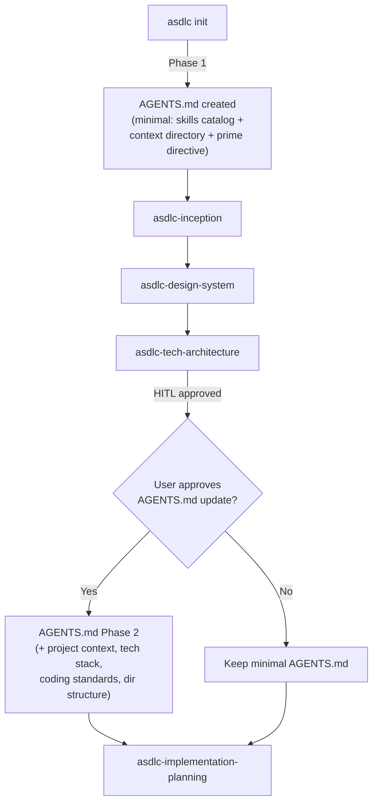

# SelfVouch Init Review — `asdlc init` Improvements

## Summary

The `asdlc init` command has several issues. Here's a comprehensive list of what's wrong and what should change.

---

## ✅ What's Correct

| Aspect | Verdict |
|---|---|
| `docs/product/` placement | Correct — standard location |
| `docs/architecture/` placement | Correct |
| `docs/sdlc/` structure | Correct |
| `.agents/skills/` with `asdlc-` prefix | Correct |
| Skills directory has all 21 skills | Correct |

---

## ⚠️ Issues Found

### Issue 1: Platform files should NOT be copied into user projects

**Current behavior:** `asdlc init` copies ALL files from `core/` into the project root:
- `AGENTS.md` ← framework bootstrapper
- `CLAUDE.md` ← Claude-specific instructions  
- `GEMINI.md` ← Gemini-specific instructions
- `ANTIGRAVITY.md` ← Antigravity-specific instructions
- `AMP.md` ← Amp-specific instructions

**Problem:** These platform files (CLAUDE.md, GEMINI.md, ANTIGRAVITY.md, AMP.md) are **agent platform installation docs**, not project files. They contain:
- Installation instructions (`pip install agentic-sdlc`)
- Platform-specific tool hints (`view_file`, `activate_skill`, etc.)
- Redundant HITL/context-directory info already in AGENTS.md

A user project shouldn't ship with "how to install agentic-sdlc" in its root. These belong in the **framework's repo** (README, docs), not in every initialized project.

**Fix:** Only copy `AGENTS.md`. Stop copying platform-specific files.

> [!IMPORTANT]
> The platform files are for the framework's own documentation ("how to use agentic-sdlc with Claude/Gemini/etc."). They should NOT be scaffolded into every user project.

---

### Issue 2: AGENTS.md should be a two-phase file

**Current behavior:** AGENTS.md is copied as a static file at `asdlc init` time with the full skills catalog, workflows, and context directory.

**Problem:** AGENTS.md should evolve with the project. After `asdlc-tech-architecture` completes, it should be enriched with:
- Project-specific coding standards (from `docs/architecture/coding-standards.md`)
- Tech stack context (from ADRs)
- Directory structure conventions
- Project-specific conventions and gotchas

**Proposed lifecycle:**

```
Phase 1 — asdlc init:
  Copy a minimal AGENTS.md with:
    - Prime Directive
    - Skill invocation instructions  
    - Skills catalog
    - Context directory structure
    - Red flags table

Phase 2 — after asdlc-tech-architecture (HITL approved):
  With user permission, UPDATE AGENTS.md to add:
    - "## Project Context" section
    - Tech stack summary (from tech-architecture.md)
    - Key coding standards (from coding-standards.md)
    - Project directory structure (from tech-architecture.md)
    - Any project-specific agent instructions
```

> [!IMPORTANT]
> The Phase 2 update should be triggered by the `asdlc-tech-architecture` skill's transition step, with HITL approval before modifying AGENTS.md.

---

### Issue 3: Templates should live under `.agents/templates/` not root `templates/`

**Current behavior:** Templates copied to `templates/` at project root.

**Problem:** The `.agents/` directory is the namespace for all agent-related config. Templates are agent tooling — they're used by skills during the SDLC process. They shouldn't pollute the project root alongside source code.

**Proposed fix:**

```
Before:                          After:
selfvouch/                       selfvouch/
  templates/                       .agents/
    brd-template.md                  skills/
    workspace-template.md            templates/
    ...                                brd-template.md
  .agents/                            workspace-template.md
    skills/                           ...
```

**Impact:** All skill references to `templates/` need updating to `.agents/templates/`. Currently only one skill directly references templates:
- [asdlc-implementation SKILL.md:26](file:///Users/salauddin/Projects/learning/sdd/agentic-sdlc/src/agentic_sdlc/skills/asdlc-implementation/SKILL.md#L26): `Copy templates/workspace-template.md`
- The [consistency.py validator](file:///Users/salauddin/Projects/learning/sdd/agentic-sdlc/src/agentic_sdlc/eval/consistency.py#L126-L128) checks `templates/` at root

---

### Issue 4: AGENTS.md references platform files that won't exist

**Current AGENTS.md** [lines 106-112](file:///Users/salauddin/Projects/learning/sdd/agentic-sdlc/src/agentic_sdlc/core/AGENTS.md#L106-L112) contains:
```markdown
- [Codex](AGENTS.md)
- [Claude Code](CLAUDE.md)
- [Gemini CLI](GEMINI.md)
- [Antigravity](ANTIGRAVITY.md)
- [Amp](AMP.md)
```

If we stop copying platform files (Issue 1), this section becomes broken links. It should be **removed from the project-level AGENTS.md** — it only belongs in the framework's own repo docs.

---

## 📋 Full Improvement List for `asdlc init`

| # | Change | Files Affected |
|---|---|---|
| 1 | **Stop copying platform files** (CLAUDE.md, GEMINI.md, ANTIGRAVITY.md, AMP.md) | [cli.py](file:///Users/salauddin/Projects/learning/sdd/agentic-sdlc/src/agentic_sdlc/cli.py#L88-L93) |
| 2 | **Remove platform links section** from AGENTS.md template | [core/AGENTS.md](file:///Users/salauddin/Projects/learning/sdd/agentic-sdlc/src/agentic_sdlc/core/AGENTS.md#L104-L113) |
| 3 | **Move templates to `.agents/templates/`** | [cli.py](file:///Users/salauddin/Projects/learning/sdd/agentic-sdlc/src/agentic_sdlc/cli.py#L79-L86), [consistency.py](file:///Users/salauddin/Projects/learning/sdd/agentic-sdlc/src/agentic_sdlc/eval/consistency.py#L124-L140) |
| 4 | **Update template path in skills** | [asdlc-implementation SKILL.md:26](file:///Users/salauddin/Projects/learning/sdd/agentic-sdlc/src/agentic_sdlc/skills/asdlc-implementation/SKILL.md#L26) |
| 5 | **Add AGENTS.md Phase 2 update** to `asdlc-tech-architecture` skill's transition | [asdlc-tech-architecture SKILL.md](file:///Users/salauddin/Projects/learning/sdd/agentic-sdlc/src/agentic_sdlc/skills/asdlc-tech-architecture/SKILL.md#L27) |
| 6 | **Add `asdlc update-agents` CLI command** (optional) to regenerate AGENTS.md with project context | New command in [cli.py](file:///Users/salauddin/Projects/learning/sdd/agentic-sdlc/src/agentic_sdlc/cli.py) |

---

## 🔄 Proposed AGENTS.md Lifecycle



---

## Decision Needed

Should I create an implementation plan to make these changes in the `agentic-sdlc` framework source?
