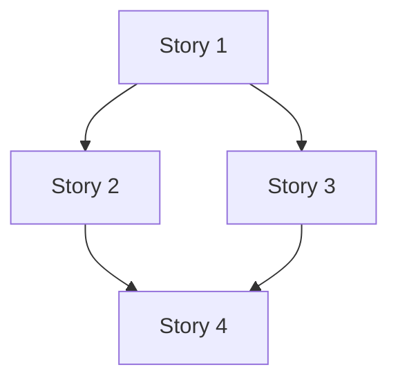

# Task Graph: [Epic Name]

> **Epic ID:** [E-NNN]
> **Date:** YYYY-MM-DD
> **Status:** Draft | Ready for HITL | Approved
> **Version:** 0.1.0
> **hitl_prompt:** [Exact HITL prompt or artifact-local reference]
> **hitl_response:** [Exact user response after HITL, blank before response]
> **hitl_decision:** [approved | changes_requested | rejected, blank before response]
> **hitl_approved_by:** [user/person, blank before response]
> **hitl_approved_at:** [timestamp/date, blank before response]

## Dependency Graph

## Story List

| ID | Title | Priority | Complexity | Risk | HITL | Files Touched | Status |
|---|---|---|---|---|---|---|---|
| [S-001] | [Title] | [P0] | [medium] | [low] | [no] | [file1, file2] | [Todo] |

---
*Written by: agentic-sdlc story-breakdown skill*
